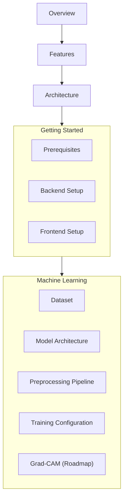
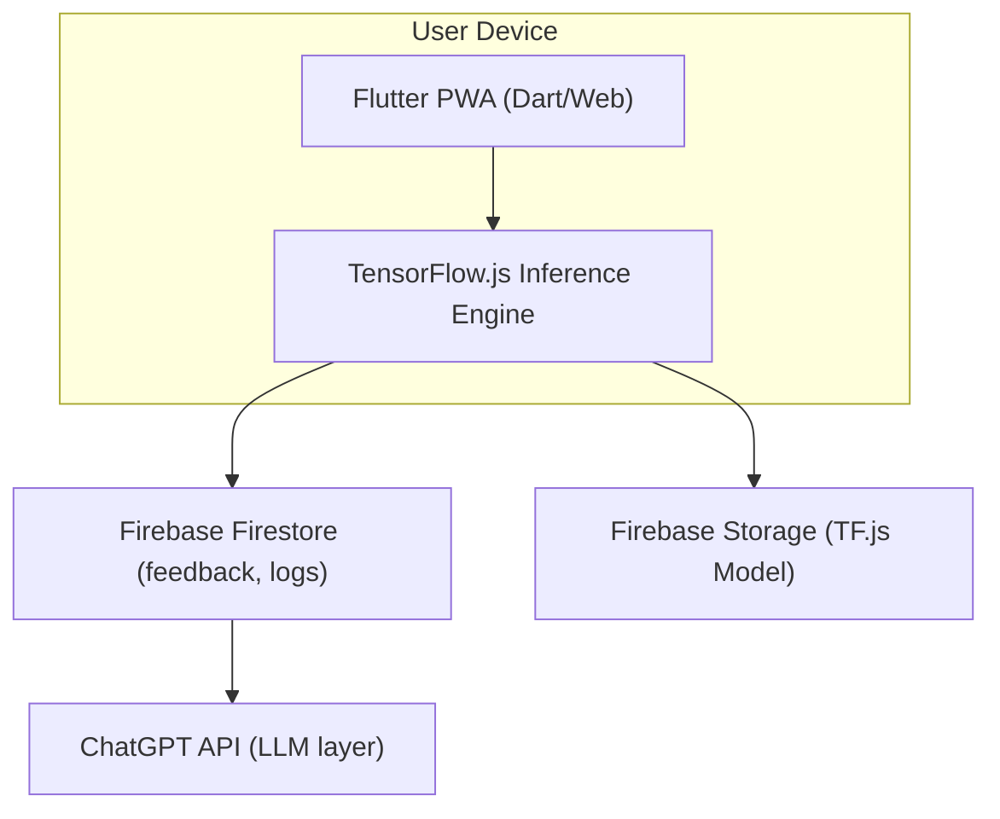

# StrokeScope

StrokeScope is a cross-platform Progressive Web App (PWA) that analyzes brain CT scans using a deep learning model to detect and classify intracranial hemorrhages. It provides plain-language, AI-generated explanations of results alongside a mandatory medical disclaimer, designed to serve as an educational and clinical decision-support tool.

StrokeScope is being built for the **2026 Apps For Good Challenge** as part of the Computer Science curriculum at the **Massachusetts Academy of Math & Science at WPI**.

**Medical Disclaimer:** StrokeScope is not a substitute for professional medical diagnosis. All results are for informational and educational purposes only. Always consult a licensed medical professional.

---

## Table of Contents



---

## Overview

Hemorrhagic strokes, which are caused by a ruptured blood vessel in the brain, account for roughly 20% of all strokes but carry disproportionately high mortality and disability rates. Rapid, accurate classification of hemorrhage type from CT imaging is critical, yet access to radiological expertise is uneven across care settings.

StrokeScope addresses this by running a fine-tuned **ResNet50** convolutional neural network directly in the browser via **TensorFlow.js**, classifying an uploaded CT scan into one of **six RSNA hemorrhage categories** in seconds, with no server round-trip required for inference. An **LLM explanation layer** (using the ChatGPT API) then translates the raw model output into understandable results for non-specialist users.

---

## Features

- **CT scan upload** — accepts DICOM, JPEG, and PNG formats
- **On-device ML inference** via TensorFlow.js so that no image data leaves the browser
- **Six-class hemorrhage classification** using the RSNA dataset label schema
- **Confidence scoring** with tiered display (Low / Moderate / High)
- **AI-generated plain-language summary** via the ChatGPT API
- **Mandatory medical disclaimer modal** before any scan analysis

---

## Architecture



The ML model is trained offline in Python (TensorFlow/Keras), converted to TF.js format, and hosted on Firebase Storage. All inference runs client-side. The ChatGPT API is called after inference to generate the plain-language result summary.

---

## Tech Stack

<div align="center">

| Layer | Technology |
|---|---|
| Frontend | Flutter (Dart), Material 3, `go_router` |
| ML Inference (client) | TensorFlow.js |
| ML Training (offline) | Python, TensorFlow/Keras, ResNet50 |
| LLM Explanation | OpenAI ChatGPT API (`gpt-4o`) |
| Backend / Database | Firebase Firestore, Firebase Storage, Firebase Hosting |
| DICOM Processing | `pydicom`, NumPy, OpenCV |
| Data Source | RSNA Intracranial Hemorrhage Detection from Kaggle |

</div>

---

## Repository Structure

```mermaid
%% StrokeScope File Tree - GitHub-safe
graph TB
    StrokeScope["📂 StrokeScope"]

    %% MVP folder
    MVP["📂 MVP"]
    StrokeScope --> MVP

    %% Backend
    backend["📂 backend"]
    MVP --> backend
    backend --> mainpy["main.py - Flask entry & API stubs"]
    backend --> configpy["config.py - Hyperparameters & paths"]

    api["📂 api"]
    backend --> api
    api --> routespy["routes.py - API route definitions (WIP)"]

    data["📂 data"]
    backend --> data
    data --> datap["data.py - RSNA CSV parsing"]
    data --> batchpy["batch.py - Batch generator"]

    functions["📂 functions"]
    backend --> functions
    functions --> modelpy["model.py - ResNet50 definition"]
    functions --> predictorpy["predictor.py - Inference wrapper"]
    functions --> dicompy["dicom.py - DICOM preprocessing"]
    functions --> windowingpy["windowing.py - CT windowing"]
    functions --> gradcampy["gradcam.py - Grad-CAM generation"]

    health["📂 health"]
    backend --> health
    health --> schemaspy["schemas.py - Pydantic/dataclass schemas"]

    %% Frontend
    frontend["📂 frontend"]
    MVP --> frontend

    lib["📂 lib"]
    frontend --> lib
    lib --> maindart["main.dart - Flutter app"]

    web["📂 web"]
    frontend --> web
    web --> indexhtml["index.html - PWA shell"]
    web --> manifestjson["manifest.json - PWA manifest"]

    frontend --> pubspec["pubspec.yaml - Dependencies"]
    frontend --> analysis["analysis_options.yaml"]

    %% Tasks
    MVP --> tasks["TASKS.txt - Sprint breakdown"]

    %% Root files
    StrokeScope --> gitignore[".gitignore"]
    StrokeScope --> license["LICENSE"]
    StrokeScope --> readme["README.md"]
```



---

## Getting Started

### Prerequisites

<div align="center">

| Tool / Resource | Version | Link |
|:-----------------:|:------:|:------:|
| Flutter SDK        | ≥ 3.11 | [Docs](https://docs.flutter.dev/get-started/install) |
| Python             | ≥ 3.9  | [Python.org](https://www.python.org/) |
| Firebase CLI       | —      | [Docs](https://firebase.google.com/docs/cli) |
| OpenAI API key  | —      | [Sign up](https://platform.openai.com/home/) |
| RSNA Dataset       | —      | [Kaggle](https://www.kaggle.com/c/rsna-intracranial-hemorrhage-detection) |
</div>

### Backend Setup

```bash
git clone https://github.com/asrwb0/StrokeScope.git
cd StrokeScope
git checkout backend

python -m venv venv
source venv/bin/activate

pip install tensorflow keras pydicom numpy opencv-python pandas scikit-learn flask flask-cors

# Configure paths
# Edit MVP/backend/config.py and update:
#   rsna_folder          → path to your downloaded RSNA dataset
#   csv_labels_path      → path to stage_1_train.csv
#   training_images_path → path to stage_1_train_images/

cd MVP/backend
python data/data.py

python functions/model.py
python main.py
```

### Frontend Setup

```bash
git checkout frontend
cd MVP/frontend

flutter pub get

# Create a .env file with API keys
# Required fields:
#   OPENAI_API_KEY=sk-ant-...
#   FIREBASE_API_KEY=...
#   FIREBASE_PROJECT_ID=...

flutter run -d chrome
flutter build web --release

# This is a Firebase step which has not yet been configured
firebase deploy --only hosting
```

---

## Machine Learning Model

### Dataset

StrokeScope uses the **RSNA Intracranial Hemorrhage Detection** dataset from Kaggle, which contains labeled brain CT scan slices in DICOM format. The dataset includes six binary labels per scan:

<div align="center">

| Label | Description |
|:---:|:---:|
| `epidural` | Epidural hemorrhage |
| `intraparenchymal` | Intraparenchymal hemorrhage |
| `intraventricular` | Intraventricular hemorrhage |
| `subarachnoid` | Subarachnoid hemorrhage |
| `subdural` | Subdural hemorrhage |
| `any` | Any hemorrhage present |

</div>

Labels are parsed from `stage_1_train.csv` using the RSNA `ImageId_type` naming convention. The dataset is split 80/20 into training and validation sets with stratified sampling on the `any` column.

### Model Architecture

The model uses **ResNet50** pretrained on ImageNet as a frozen feature extractor, with a custom classification head for multi-label hemorrhage detection:

```
ResNet50 (pretrained, frozen)
    └── GlobalAveragePooling2D
        └── Dense(256, activation='relu')
            └── Dropout(0.5)
                └── Dense(6, activation='sigmoid')   ← one output per hemorrhage type
```

The sigmoid output allows independent predictions for each hemorrhage type (multi-label), since a scan can contain more than one type simultaneously.

Fine-tuning support is built in via `unfreeze_base()`, which unfreezes the ResNet50 layers and recompiles at a reduced learning rate (`1e-5`) for a second training pass.

### Preprocessing Pipeline

Each DICOM file goes through a dedicated three-stage preprocessing pipeline before being passed to the model:

**1. HU Conversion (`dicom.py`)**

Raw pixel values are converted to Hounsfield Units (HU) using the DICOM metadata fields `RescaleSlope` and `RescaleIntercept`. HU values encode tissue density, making this conversion essential for windowing.

**2. CT Windowing (`windowing.py`)**

Three clinically standard CT windows are applied to isolate different tissue types:

<div align="center">

| Window | Purpose |
|:---:|:---:|
| Brain window | Parenchymal tissue differentiation |
| Subdural window | Blood/fluid detection near the dura |
| Bone window | Skull and bony structure visualization |

</div>

Each window clips and normalizes the HU array to [0, 1], and the three resulting arrays are stacked together as RGB channels, forming a single 3-channel image that simultaneously encodes multi-tissue information. This approach is common in CT deep learning pipelines and allows standard ImageNet-pretrained models to be applied to CT data.

**3. Resize & Normalize**

The stacked image is resized to **224×224** pixels (ResNet50 input size) using `cv2.INTER_AREA` interpolation, then passed through ResNet50's `preprocess_input` to apply ImageNet-standard normalization.

### Training Configuration

```python
HYPERPARAMS = {
    "epochs": 10,
    "learning_rate": 1e-4,       # initial training pass
    "dropout_rate": 0.5,
    "num_classes": 6,
    "shuffle_buffer": 1000
}

# Fine-tuning pass
FINE_TUNE_LR = 1e-5
IMAGES_PER_BATCH = 8
IMAGE_SIZE = 224
```
<div align="center">

| Setting | Value |
|:---:|:---:|
| Loss | `BinaryCrossentropy` (multi-label) |
| Optimizer | `Adam` |
| Metrics | `accuracy`, `AUC` (multi-label) |
| Batch size | 8 |
| Image size | 224×224 |
| Output classes | 6 |

</div>

### Grad-CAM (Roadmap)

A Grad-CAM implementation targeting `conv5_block3_out` (the final ResNet50 convolutional block) is partially implemented in `functions/gradcam.py`. It uses `tf.GradientTape` to compute class-activation heatmaps that highlight the regions of the scan most influential to the prediction. This feature is deferred from the MVP but is the top priority for a post-MVP release.

---

## Frontend

### Pages & Routing

The Flutter app uses `go_router` for declarative routing across three pages:

<div align="center">

| Route | Page | Description |
|:---:|:---:|:---:|
| `/` | `HomePage` | Mission statement, how-it-works flow, stroke education cards, CTA |
| `/analyze` | `AnalyzePage` | CT scan upload, file picker, results display (WIP) |
| `/feedback` | `FeedbackPage` | Structured feedback form, star rating, Firestore submission |

</div>

### Key Components

**`NavBar`** — Fixed top navigation bar (`#0A1F44` deep navy). Renders active route highlighting and links to all three pages. Logo is currently a text placeholder.

**`AnalyzePage` / `_buildUploadBox()`** — Dotted-border upload zone accepting `.dcm`, `.dicom`, `.jpg`, `.jpeg`, and `.png`. Displays an empty state with instructions and a "Browse Files" button; once a file is selected, shows the filename and an "Analyze File" button. Files exceeding 10MB will be rejected with an error message.

**`FeedbackPage` / `MyCustomForm`** — Fully validated feedback form including:
- Role dropdown (Medical Professional, Researcher, Patient, Student, Other)
- Interactive 5-star `StarRatingWidget`
- Area-of-feedback dropdown (Analysis, Home Page, Contact Us, Overall Experience)
- Consent/permission dropdown
- Two open-text comment fields
- Submit button (wired to Firestore via `feedback_service.dart`, in progress)

**`StarRatingWidget`** — Reusable stateful widget supporting customizable star count, initial rating, color, and an `onRatingChanged` callback.

### Flutter Dependencies

```yaml
dependencies:
  flutter:
    sdk: flutter
  go_router: ^17.1.0
  google_fonts: (latest)
  file_picker: (latest)
  dotted_border: (latest)
  dio: (latest)
  cupertino_icons: ^1.0.8
  # Pending Firebase integration:
  # firebase_core
  # cloud_firestore
  # firebase_storage
```

---

## API Reference

The Flask backend (`main.py`) defines the following endpoints. Full implementation is in progress.

### `POST /api/analyze`

Accepts a CT scan image, runs inference, and returns a structured result.

**Request:** `multipart/form-data` with field `file` (DICOM / JPEG / PNG, max 10MB)

**Response:**
```json
{
  "predicted_class": "subdural",
  "confidence": 0.87,
  "confidence_tier": "High",
  "all_class_scores": {
    "epidural": 0.03,
    "intraparenchymal": 0.11,
    "intraventricular": 0.05,
    "subarachnoid": 0.09,
    "subdural": 0.87,
    "any": 0.94
  },
  "low_confidence": false,
  "llm_explanation": "The model detected signs consistent with a subdural hemorrhage...",
  "disclaimer": "This result is not a medical diagnosis. Consult a licensed healthcare provider."
}
```

**Confidence tiers:**

<div align="center">

| Tier | Range |
|:---:|:---:|
| Low | < 0.60 |
| Moderate | 0.60 – 0.80 |
| High | > 0.80 |

</div>

### `GET /api/heatmap/<filename>`

Serves a generated Grad-CAM heatmap image from the heatmaps folder. Returns 404 if the file does not exist. *(Roadmap feature)*

### `POST /api/feedback`

Saves user feedback to Firestore.

**Request body:**
```json
{
  "ease_of_use": 4,
  "comments": "Very intuitive interface.",
  "timestamp": "2026-04-07T14:00:00Z"
}
```

### `GET /api/health`

Returns server health status. Used for uptime monitoring and deployment checks.

```json
{ "status": "ok" }
```

---

## Roadmap

<div align="center">

| Feature | Status |
|:---:|:---:|
| CT scan upload & file validation | Complete |
| Flutter routing (3 pages) | Complete |
| Home page education content | Complete |
| Feedback form with star rating | Complete |
| ResNet50 model architecture | Complete |
| DICOM preprocessing pipeline | Complete |
| CT windowing (brain/subdural/bone) | Complete |
| Batch data generator | Complete |
| Model training & fine-tuning | In Progress |
| TF.js model conversion | In Progress |
| Firebase Storage model hosting | In Progress |
| TF.js client-side inference | In Progress |
| LLM explanation layer (ChatGPT API) | In Progress |
| Results UI (confidence, AI summary) | In Progress |
| Firebase Firestore integration | In Progress |
| Medical disclaimer modal | In Progress |
| Firebase Hosting deployment | Planned |
| Merge `frontend` + `backend` → `main` | Planned |
| Grad-CAM heatmap overlay | Post-MVP |
| Patient scan history dashboard | Post-MVP |
| U-Net lesion segmentation | Post-MVP |
| Downloadable PDF report | Post-MVP |
| HIPAA-compliant data handling | Post-MVP |
| Advanced stroke subtype classification | Post-MVP |

</div>

---

## License

This project is licensed under the terms found in [LICENSE](./LICENSE).
