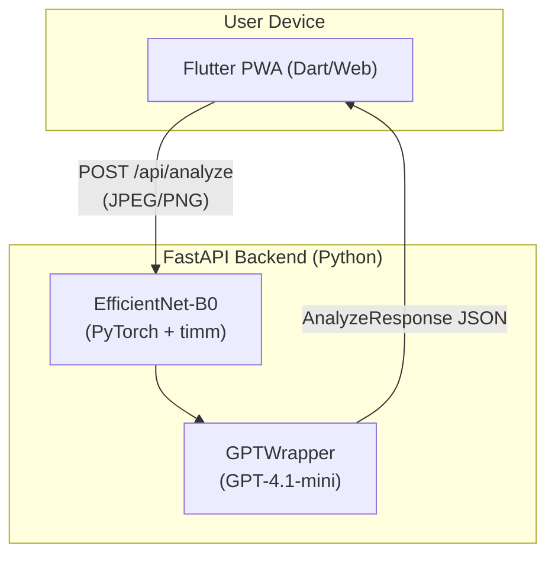

# StrokeScope

StrokeScope is a full-stack Progressive Web App that analyzes brain CT scans using a fine-tuned deep learning model to detect stroke. It returns a binary classification (Normal vs. Stroke), confidence scoring, and a plain-language AI-generated explanation — all designed as an educational and clinical decision-support tool.

Built for the **2026 Apps For Good Challenge** as part of the Computer Science curriculum at the **Massachusetts Academy of Math & Science at WPI**.

> **Medical Disclaimer:** StrokeScope is not a substitute for professional medical diagnosis. All results are for informational and educational purposes only. Always consult a licensed medical professional.

---

## Table of Contents

- [Overview](#overview)
- [Features](#features)
- [Architecture](#architecture)
- [Getting Started](#getting-started)
- [Machine Learning Model](#machine-learning-model)
- [API Reference](#api-reference)
- [Frontend](#frontend)
- [Roadmap](#roadmap)
- [AI Use Disclosure](#ai-use-disclosure)

---

## Overview

Hemorrhagic and ischemic strokes together are among the leading causes of death and disability worldwide. Rapid identification of stroke from CT imaging is critical, yet radiological expertise is unevenly distributed across care settings.

StrokeScope runs a fine-tuned **EfficientNet-B0** convolutional neural network on a **FastAPI** backend, classifying an uploaded CT scan as **Normal** or **Stroke** in seconds. A **GPT-4.1-mini explanation layer** translates raw model output into a structured, plain-language summary for non-specialist users.

---

## Features

- **CT scan upload** — accepts JPEG, PNG, and BMP formats
- **Binary stroke classification** — Normal vs. Stroke using EfficientNet-B0
- **Confidence scoring** with tiered display (Low / Moderate / High)
- **AI-generated plain-language explanation** via GPT-4.1-mini, structured as Finding / Confidence / Details / Safety Note
- **FastAPI backend** with `/api/analyze`, `/api/feedback`, and `/api/health` endpoints
- **Flutter web frontend** with upload zone, results panel, and feedback form
- **Mandatory medical disclaimer** on all results

---

## Architecture


```mermaid
flowchart TD
    subgraph User_Device["User Device"]
        A["Flutter PWA (Dart/Web)"]
    end

    subgraph Backend["FastAPI Backend (Python)"]
        B["EfficientNet-B0\n(PyTorch + timm)"]
        C["GPTWrapper\n(GPT-4.1-mini)"]
        B --> C
    end

    A -- "POST /api/analyze\n(JPEG/PNG)" --> B
    C -- "AnalyzeResponse JSON" --> A
```

The Flutter frontend uploads a CT scan to the FastAPI backend. The backend runs inference with the PyTorch model, passes the result to the GPT wrapper for plain-language explanation, and returns a structured JSON response.

---

## Tech Stack

| Layer | Technology |
|---|---|
| Frontend | Flutter (Dart), Material 3, `go_router` |
| Backend | Python, FastAPI, Uvicorn |
| ML Model | PyTorch, timm, EfficientNet-B0 |
| Preprocessing | Albumentations, Pillow, OpenCV |
| LLM Explanation | OpenAI GPT-4.1-mini |
| Data Source | Brain Stroke CT Dataset (`ozguraslank/brain-stroke-ct-dataset`, Kaggle) |

---

## Repository Structure

```
StrokeScope/
├── backend/
│   ├── main.py                  # FastAPI app, lifespan model loading
│   ├── config.py                # Hyperparameters, paths, class names
│   ├── requirements.txt
│   ├── api/
│   │   └── routes.py            # /analyze, /feedback, /health endpoints
│   ├── functions/
│   │   ├── model.py             # EfficientNet-B0 + binary head definition
│   │   ├── predictor.py         # Preprocessing + inference wrapper
│   │   ├── wrapper.py           # GPT-4.1-mini explanation layer
│   │   └── gradcam.py           # Grad-CAM (roadmap)
│   ├── health/
│   │   └── schemas.py           # Pydantic response schemas
│   └── data/
│   │   └── data.py              # Dataset utilities for local retraining
└── frontend/
    └── lib/
│       └── main.dart            # Full Flutter app (3 pages)
├── .gitignore
├── LICENSE
└── README.md
```

---

## Getting Started

### Prerequisites

| Tool | Version |
|---|---|
| Flutter SDK | ≥ 3.11 |
| Python | ≥ 3.9 |
| OpenAI API key | GPT-4.1-mini access |

### Backend Setup

```bash
git clone https://github.com/asrwb0/StrokeScope.git
cd StrokeScope/backend

python -m venv venv
source venv/bin/activate  # Windows: venv\Scripts\activate

pip install fastapi uvicorn[standard] python-multipart \
            torch timm albumentations Pillow opencv-python-headless \
            pydantic openai python-dotenv
```

Place your trained weights file at `backend/best_model.pth`.

Create `backend/.env`:
```
OPENAI_API_KEY=sk-...
```

Start the server:
```bash
python main.py
# API running at http://localhost:8000
# Swagger UI at http://localhost:8000/docs
```

### Frontend Setup

```bash
cd frontend
flutter pub get
flutter run -d chrome
```

---

## Machine Learning Model

### Dataset

StrokeScope uses the **Brain Stroke CT Dataset** by ozguraslank, available on Kaggle. The dataset contains CT scan slices organized into three folders:

| Folder | Label | Binary Label |
|---|---|---|
| `Normal/PNG/` | Healthy scan | 0 |
| `Bleeding/PNG/` | Haemorrhagic stroke | 1 |
| `Ischemia/PNG/` | Ischaemic stroke | 1 |

Bleeding and Ischemia are collapsed into a single **Stroke** label (1) for binary classification. The dataset is split 80/20 with stratified sampling.

### Model Architecture

EfficientNet-B0 pretrained on ImageNet as a feature extractor, with a custom binary classification head:

```
EfficientNet-B0 (timm, global average pooling)
    └── Dropout(0.3)
        └── Linear(n_features → 256)
            └── SiLU
                └── Dropout(0.2)
                    └── Linear(256 → 1)   ← single logit, sigmoid → probability
```

A sigmoid score ≥ 0.5 is classified as **Stroke**. The positive-class weight (`n_normal / n_stroke`) is applied in `BCEWithLogitsLoss` during training to handle class imbalance.

### Preprocessing Pipeline

At inference time, uploaded images go through:

1. **Decode** — JPEG/PNG bytes → PIL RGB → NumPy uint8
2. **Resize** — to 224×224 (EfficientNet-B0 input size)
3. **Normalize** — ImageNet mean/std via Albumentations
4. **Tensorize** — CHW float32 tensor, batch dim added

This pipeline mirrors the validation transform used during training exactly.

### Training Configuration

| Setting | Value |
|---|---|
| Backbone | EfficientNet-B0 (timm) |
| Loss | `BCEWithLogitsLoss` with pos_weight |
| Optimizer | Adam |
| Image size | 224×224 |
| Output | 1 logit (binary) |
| Weights file | `best_model.pth` (state_dict) |

---

## API Reference

### `POST /api/analyze`

Accepts a CT scan image and returns a binary classification with confidence scores and AI explanation.

**Request:** `multipart/form-data`, field `file` (JPEG / PNG / BMP, max 10 MB)

**Response:**
```json
{
  "predicted_class": "Stroke",
  "confidence": 0.91,
  "confidence_tier": "High",
  "stroke_probability": 0.91,
  "low_confidence": false,
  "all_class_scores": {
    "Normal": 0.09,
    "Stroke": 0.91
  },
  "llm_explanation": "Finding:\nThe model detected imaging features consistent with stroke...\n\nConfidence:\nHigh confidence (91%)...\n\nDetails:\nStroke probability 91%, Normal probability 9%...\n\nSafety Note:\nThis is not a medical diagnosis...",
  "disclaimer": "This result is not a medical diagnosis. StrokeScope is an educational and decision-support tool only. Always consult a licensed medical professional for any clinical decisions."
}
```

**Confidence tiers:**

| Tier | Range |
|---|---|
| Low | < 0.60 |
| Moderate | 0.60 – 0.80 |
| High | > 0.80 |

### `POST /api/feedback`

Saves user feedback.

**Request body:**
```json
{
  "ease_of_use": 4,
  "comments": "Very intuitive interface.",
  "timestamp": "2026-05-07T14:00:00Z"
}
```

### `GET /api/health`

Returns server and model status.

```json
{ "status": "ok", "model_loaded": true, "device": "cpu" }
```

---

## Frontend

### Pages

| Route | Page | Description |
|---|---|---|
| `/` | `HomePage` | Mission statement, how-it-works flow, stroke education cards |
| `/analyze` | `AnalyzePage` | CT scan upload, binary results panel, AI explanation card |
| `/feedback` | `FeedbackPage` | Structured feedback form with star rating and confirmation |

### Results Panel

After analysis, the right panel renders:

- **Verdict header** — "⚠ Stroke Detected" (red) or "✓ No Stroke Detected" (green)
- **Confidence tier and percentage**
- **Score bars** — Normal and Stroke probabilities as linear progress bars
- **Low confidence warning** (amber) — shown when confidence < 60%
- **AI Explanation card** — GPT output parsed into four labelled sections: FINDING, CONFIDENCE, DETAILS, SAFETY NOTE
- **Medical disclaimer**

### Flutter Dependencies

```yaml
dependencies:
  flutter:
    sdk: flutter
  go_router: ^17.1.0
  google_fonts: latest
  file_picker: latest
  dotted_border: latest
  dio: latest
  cupertino_icons: ^1.0.8
```

---

## Roadmap

| Feature | Status |
|---|---|
| CT scan upload & file validation | Complete |
| Flutter routing (3 pages) | Complete |
| Home page education content | Complete |
| Feedback form with star rating + snackbar | Complete |
| EfficientNet-B0 binary model | Complete |
| FastAPI backend with PyTorch inference | Complete |
| GPT-4.1-mini explanation layer | Complete |
| Binary results UI (confidence, AI summary) | Complete |
| Medical disclaimer on all results | Complete |
| Firebase Firestore feedback integration | In Progress |
| Firebase Hosting deployment | Planned |
| Grad-CAM heatmap overlay | Post-MVP |
| Patient scan history dashboard | Post-MVP |
| Downloadable PDF report | Post-MVP |
| HIPAA-compliant data handling | Post-MVP |

---

## AI Use Disclosure

StrokeScope was developed by high school students as part of a rigorous independent computer science curriculum. In the interest of transparency, we are disclosing how AI assistance was used during development.

**Tools used:** Claude Sonnet 4.6, GitHub Copilot.

**How it was used:** At the outset of the project, Claude was used to generate a comprehensive task breakdown and skeleton code structure, helping establish a clear development roadmap and project architecture before any feature implementation began. This gave the team a solid foundation to build from rather than starting from a blank slate.

Throughout development, Claude played a significant role across the stack, assisting with backend implementation, PyTorch model integration, FastAPI patterns, frontend layout, and debugging. Claude was used heavily at times, particularly when implementation challenges fell outside the team's existing knowledge. In all cases, generated code was reviewed, tested, debugged, and deliberately modified by the student developers to fit the project's specific requirements.

GitHub Copilot was used for quick fixes in syntax or inaccurate implementation of code. Copilot was occasionally used to generate code, but its primary function was to revise team-written code to ensure accuracy.

---

## License

This project is licensed under the terms found in [LICENSE](./LICENSE).

*Built at the Massachusetts Academy of Math & Science at WPI.*
